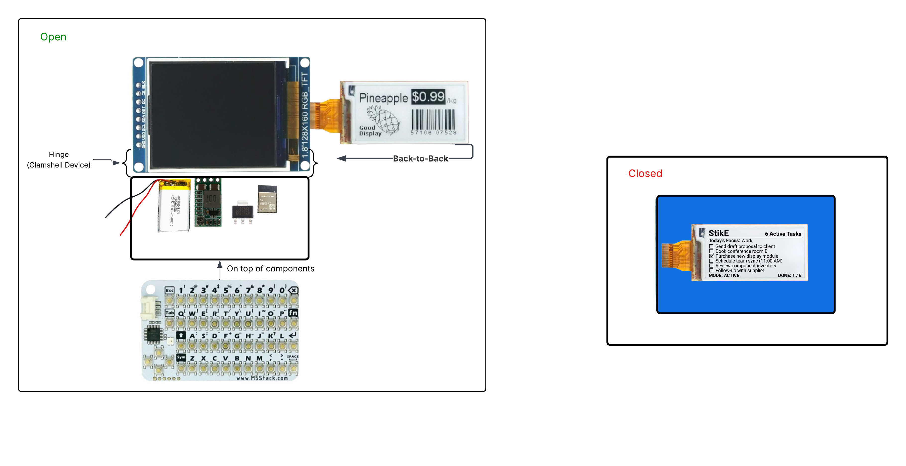

# StikE — Hardware README

This document covers the hardware design of the STIK-eNote: component selection, subsystem architecture, PCB design decisions, pin mappings, and assembly notes. For firmware and software setup, see [`README_software.md`](./README_software.md).

> **Prototype vs. PCB:** The current working build is a hand-wired prototype using off-the-shelf modules. The PCB design (V2, KiCad) is complete and documented here, but has not yet been manufactured. All schematics, gerbers, and layout files are in [`project_02/hardware/`](./project_02/hardware/).

---

## System Overview

StikE is a clamshell device. The bottom half holds the PCB, battery, and keyboard. The top half holds the two displays back-to-back on the hinge: the TFT faces inward (visible when open) and the ePaper faces outward (visible when closed).

**Open (Active Mode):** The lid opening triggers a wake pulse via a Hall effect switch in the hinge. The ESP32-S3 wakes from deep sleep, the TFT backlight turns on, and the device is ready for input.

**Closed (Persistent Mode):** The ESP32-S3 is in deep sleep. The ePaper display holds its last image without drawing any power, showing the current task list through a window in the case.



---

## Block Diagram


The main signal and power paths:

- **800mAh LiPo** → Buck-Boost Converter (+5V rail) → LDO Regulator (+3.3V rail)
- **+3.3V rail** powers: ESP32-S3, ePaper display, TFT display
- **+5V rail** powers: M5Stack CardKB keyboard (via I2C level shifter)
- **ESP32-S3 SPI2 (FSPI)** → ePaper display (GDEQ0213B74)
- **ESP32-S3 SPI3 (HSPI)** → TFT display (ST7735S)
- **ESP32-S3 I2C** → Level Shifter → CardKB keyboard
- **Hall Effect Switch** → RC Differentiator → GPIO 14 (wake pin)
- **USB-C** → Battery charger + programming/debug

---

## Components

### Modules (not on PCB — external/connectorized)

| Reference | Part | Supplier |
|---|---|---|
| U_LCD | ST7735S 1.8" 128×160 SPI TFT LCD | Amazon (B0F1C8X7D8) |
| U_EPD | GDEQ0213B74 2.13" ePaper + adapter board | AliExpress |
| U_KB | M5Stack CardKB v1.1 I2C Keyboard | M5Stack (SKU U035-B) |
| — | 800mAh LiPo battery | — |

### PCB Components

| Reference | Part Number | Value | Description |
|---|---|---|---|
| U6 | ESP32-S3-WROOM-1-N16R8 | — | Main MCU (Wi-Fi/BT module, 16MB flash, 8MB PSRAM) |
| U3 | TPS613222ADBVR | — | Synchronous boost converter (battery → +5V) |
| U5 | XC6206P332MR-G | 3.3V | LDO linear regulator (+5V → +3.3V) |
| U1 | TPB4056A20-ES1R | — | Single-cell LiPo charger |
| U2 | DRV5032FADBZR | — | Linear Hall effect switch (lid sensor) |
| Q5, Q7 | BSS138 | — | N-CH MOSFETs (I2C level shifter) |
| L1 | VLS252012ET-2R2M | 2.2µH | Boost converter inductor |
| D1 | BAT41ZFILM | — | Schottky diode |
| D2 | LTST-C191KRKT | — | LED, red (charge status) |
| D3 | LTSTC191KGKT | — | LED, green (charge status) |
| C1, C2, C10, C11 | CL10A106KP8NNNC | 10µF | Boost converter capacitors |
| C3, C4, C6, C9, C12 | CL10B105KA8NNNC | 1µF | Decoupling capacitors |
| C5 | GRM188R61E475KE11D | 4.7µF | Decoupling capacitor |
| C7 | CC0603KRX7R9BB104 | 0.1µF | Decoupling capacitor |
| R1–R5, R9, R17 | RC0603FR-071KL | 1kΩ | General purpose resistors |
| R6, R8 | RC0603FR-075K1L | 5.1kΩ | USB-C CC resistors |
| R10, R12 | RC0603FR-0710KL | 10kΩ | I2C pull-ups (3.3V side) |
| R11, R13 | RC0603FR-0710KL | 10kΩ | I2C pull-ups (5V side) |
| R16 | RC0603FR-07100KL | 100kΩ | RC differentiator (wake circuit) |
| J2 | UJ20-C-H-G-SMT-1-P16-TR | — | USB-C connector |
| SW1 | — | — | BOOT button |
| SW2 | — | — | RESET button |

---

## Subsystems

### Power Path

The LiPo battery output is not stable enough to feed logic directly — cell voltage varies from ~4.2V fully charged down to ~3.0V at cutoff. A **TPS613222ADBVR synchronous boost converter** steps the battery voltage up to a regulated +5V rail, keeping the rail stable across the full discharge curve. A 2.2µH inductor (L1) handles energy storage during the switching cycle, and three 10µF output capacitors (C2, C10, C11) smooth the output to minimize ripple on the 5V rail. This matters specifically for I2C stability on the keyboard bus.

From the +5V rail, an **XC6206P332MR-G LDO** drops down to a clean +3.3V for all logic-level peripherals. A linear regulator here is less efficient than a second switching stage would be — at full ESP32 load the LDO dissipates a noticeable amount of heat — but it adds no switching noise to the 3.3V rail, keeps the design simple, and requires almost no support components. For a v1 design it was the right call.

Battery charging is handled by a **TPB4056A20-ES1R** single-cell linear charger. It is connected to the VBUS pin of the USB-C connector and handles charge termination automatically. Two status LEDs (D2 red, D3 green) indicate charge state. The USB-C CC pins each have a 5.1kΩ pull-down resistor (R6, R8), which is the standard configuration for a 5V UFP (power sink) device.

### Display Buses

The two displays sit on completely separate SPI buses, and this is not optional.

The **ePaper (GDEQ0213B74)** runs on **SPI2 (FSPI)**, using the ESP32-S3's default FSPI pins. The **TFT (ST7735S)** runs on **SPI3 (HSPI)**, using the default HSPI pins. Both display libraries (`GxEPD2` and `TFT_eSPI`) are built on the same underlying SPI infrastructure, and their timing assumptions about bus ownership are incompatible enough that sharing a single bus caused consistent initialization failures in testing. Additionally, the initialization sequence requires the ePaper to be fully initialized and hibernated before the TFT bus is brought up. Separate buses, with dedicated CS lines, solved all of this cleanly.

A practical consequence of using the default FSPI and HSPI pins (rather than remapping via the ESP32's GPIO matrix) is that some signal traces on the PCB needed to cross each other. Rather than remap pins in software — which introduced instability in testing — those crossovers are handled in copper with vias. It is a form of technical debt, but it is localized entirely to the PCB layout.

The TFT backlight (GPIO 42) requires explicit `pinMode(OUTPUT)` and `digitalWrite(LOW)` to fully cut the backlight during sleep. The ESP32 PWM timer holds the pin in an intermediate state otherwise, and the backlight does not fully turn off.

### I2C Level Shifter

The CardKB keyboard operates at 5V I2C logic levels. The ESP32-S3 is a 3.3V device. A classic **two-MOSFET bidirectional level shifter** handles both SDA and SCL lines.

Each channel uses a **BSS138 N-channel MOSFET** with 10kΩ pull-up resistors on both the 3.3V side (R10, R12) and the 5V side (R11, R13). When either side drives the line LOW, the MOSFET conducts and pulls the other side LOW. When neither side drives, both pull-ups hold their respective sides HIGH at their own voltage levels. The circuit is bidirectional by design and handles the open-drain nature of I2C correctly.

### Wake Circuit (Hall Effect + RC Differentiator)

The lid hinge contains a small magnet. A **DRV5032FADBZR linear Hall effect switch** on the PCB detects the magnet's presence. When the lid is closed, the magnet holds the switch output in one state. When the lid opens, the output changes.

The ESP32's deep sleep wake pin responds to a **rising edge pulse**, not a sustained level. If the raw switch output were connected directly, the pin would stay asserted the entire time the lid was open, which would prevent the auto-sleep feature from working — the device is designed to sleep on its own during inactivity regardless of lid state, and a held-high wake pin interferes with that.

An **RC differentiator** (R16 = 100kΩ, C12 = 1µF) converts the Hall switch's binary output transition into a brief rising-edge pulse. The ESP32 sees the edge, wakes, and the wake pin returns to its idle state. The lid can stay open indefinitely without preventing subsequent sleep cycles.

### USB-C

The USB-C connector (J2) is wired as a 5V power sink. VBUS feeds the battery charger and serves as the 5V host input. D+ and D- are routed to the ESP32-S3's native USB pins (GPIO 19, 20) for programming and serial debug. The CC lines have 5.1kΩ pull-downs per the USB-C specification for UFP devices without power delivery negotiation.

---

## Pin Mapping

All GPIO assignments are defined in `include/pins.h`.

### ePaper Display (GDEQ0213B74) — SPI2 / FSPI

| Signal | GPIO |
|---|---|
| SCK | 5 |
| MOSI | 6 |
| CS | 7 |
| DC | 16 |
| RST | 15 |
| BUSY | 17 |

### TFT Display (ST7735S) — SPI3 / HSPI

| Signal | GPIO |
|---|---|
| SCK | 12 |
| MOSI | 11 |
| MISO | 8 |
| CS | 10 |
| DC | 9 |
| RST | 13 |
| Backlight | 42 |

### Keyboard (M5Stack CardKB) — I2C

| Signal | GPIO |
|---|---|
| SDA | 18 |
| SCL | 21 |
| I2C Address | 0x5F |

### Other

| Signal | GPIO | Notes |
|---|---|---|
| Wake Button / Hall Switch | 14 | Moved from default to avoid conflict with ePaper RST |
| USB D- | 19 | Reserved — do not reassign |
| USB D+ | 20 | Reserved — do not reassign |
| OPI PSRAM | 35, 36, 37 | Reserved — do not reassign |
| Strapping pins | 0, 3, 45, 46 | Avoid for general GPIO use |

---

## PCB Design

**Design tool:** KiCad 10.0.1
**Revision:** V3
**Target board size:** 3.5" × 2.0" (within the 4" × 5" class budget)
**Layer stack:** 2-layer (signal top, ground plane bottom)

### Layout Notes

The width is constrained to 3.5" specifically to leave room for the LiPo battery sitting alongside the PCB within the fixed chassis footprint, which is set by the keyboard dimensions.

All passive components are 0603. ICs are SOIC or SOT-23. Nothing smaller than 0603 was used, because the design assumes hand soldering for the prototype build.

Via crossovers: as noted in the display bus section, some traces cross between layers using vias rather than remapping the GPIO assignments in software. The crossovers are concentrated around the display connector area and are visible on the top copper layer.

### Ground Plane and Antenna Exclusion Zone

The bottom copper layer is a solid ground plane across most of the board. There is a copper exclusion zone cut out beneath and around the antenna end of the ESP32-S3-WROOM-1 module. The module is designed to overhang the board edge slightly — the antenna portion is meant to be clear of the PCB substrate — and pouring copper underneath would detune the antenna. The keep-out preserves the antenna's radiation pattern.

### Schematic Organization (5 sheets)

| Sheet | Contents |
|---|---|
| 1 — Top Level | ESP32-S3 connections, display headers, keyboard connector, reset/boot buttons |
| 2 — Power Circuitry | LiPo charger, boost converter, 3.3V LDO, lid switch circuit |
| 3 — ESP32-S3 | Full ESP32-S3-WROOM-1 module pinout and net assignments |
| 4 — Logic Level Converter | BSS138 bidirectional I2C level shifter for CardKB |
| 5 — USB-C | USB-C connector, CC resistors, D+/D- routing |

Schematics are in [`project_02/hardware/`](./project_02/hardware/) as both KiCad source and exported PDF.

---

## Assembly Notes (Prototype)

The current prototype is built from modules wired together, not from the PCB. For anyone assembling the PCB when it is manufactured:

- Solder all SMD components before through-hole headers.
- The ESP32 module goes on last. Leave the antenna end clear of the board edge as intended.
- The LDO (U5, SOT-23) and boost converter IC (U3, SOT-23-5) are the smallest parts. Use flux and take your time.
- After assembly, use the `STike_SYSTEM_TEST` firmware build to validate each subsystem before running the main application — test the SPI buses, ePaper refresh, TFT color output, and I2C keyboard independently.
- The TFT and ePaper connect via through-hole headers in the current PCB revision. Route ribbon cables through the hinge carefully — stress on those connections is the most likely failure point in a clamshell form factor.

---

## Known Limitations and Future Revisions

**Through-hole display headers:** A board-to-board or FPC connector between the main PCB and a dedicated display adapter board on the upper half would be more reliable than ribbon cables through a hinge. This is the most important mechanical change for a v2 PCB.

**Display sizing:** Neither display closely matches the CardKB footprint, and the ePaper is noticeably narrower. Future revisions would use displays dimensioned to match the keyboard width, which would also make the closed device look more cohesive.

**3.3V LDO efficiency:** Replacing the XC6206 LDO with a synchronous buck converter for the 3.3V rail would reduce heat dissipation at high ESP32 load and extend battery life. The added component complexity is worth it once the design is more mature.

**Ground plane near LDO:** Under high current draw the LDO runs warm. A larger ground copper pour on the top layer around U5 for additional thermal spreading would help, or a proper thermal pad if the footprint is revised.

---

## Repository Structure (Hardware)

```
project_02/
├── hardware/
│   ├── stike.kicad_pro
│   ├── stike.kicad_sch         # Top-level schematic
│   ├── stike.kicad_pcb         # PCB layout
│   ├── stike.kicad_sym         # Symbol library
│   ├── stike.pretty/           # Footprint library
│   └── mfg/                    # Manufacturing outputs
│       └── gerbers/
└── docs/
    ├── stike_schematic.pdf     # Exported schematic PDF
    ├── STIKE_BOM.xlsx          # Bill of materials
    ├── MechanicalDiagram.png
    └── ElectricalDiagram.png
```

---

## Links

- Software README: [`README_software.md`](./README_software.md)
- Hackster.io: [Project Page](https://www.hackster.io/bm150/stike-note-e0d2a9)
